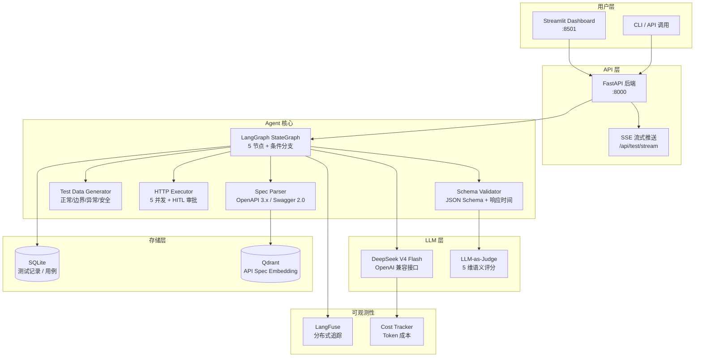
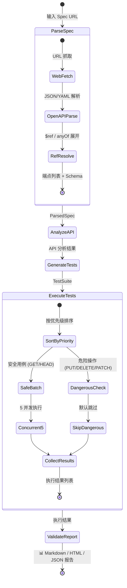

# API Test Agent 🧪

[](https://www.python.org/)
[](https://fastapi.tiangolo.com/)
[](https://langchain-ai.github.io/langgraph/)
[](https://platform.deepseek.com/)
[](https://www.docker.com/)
[](LICENSE)

基于 **LangGraph + DeepSeek** 的 REST API 自动化测试 Agent。输入 OpenAPI Spec URL，自动完成文档解析 → 测试用例生成 → 并发执行 → Schema 验证 → 测试报告的全流程。

> 🎯 **核心价值**: 从 API 文档到测试报告，全程零人工介入；自动发现 API 的输入验证缺陷、安全漏洞和边界处理问题。

---

## 架构总览



## Agent 执行流程



## 核心能力

| 能力 | 说明 |
|------|------|
| 🔍 **智能文档解析** | 支持 OpenAPI 3.x / Swagger 2.0 JSON/YAML，自动抓取 Swagger UI 页面 |
| 🧬 **四维测试覆盖** | 正常用例 / 边界测试 / 异常输入 / 安全攻击（SQL 注入、XSS、越权） |
| ⚡ **并发执行** | 安全用例 5 并发，危险操作（PUT/DELETE/PATCH）默认跳过避免误操作 |
| 🛡️ **多层安全防御** | 输入过滤 → 工具参数校验 → 敏感信息检测 → 响应数据防泄露 |
| 🧠 **LLM-as-Judge** | 自动区分真实 Bug vs 测试设计问题 vs 环境问题，5 维语义评分 |
| 📊 **多格式报告** | Markdown / HTML / JSON 报告 + Streamlit 可视化 Dashboard |
| 💾 **双重持久化** | SQLite 存储测试用例和执行记录，Qdrant 存储 API Spec 向量嵌入 |
| 🔄 **断点续跑** | LangGraph checkpoint（内存级），支持同进程内状态恢复与调试 |
| 💰 **成本追踪** | 多模型 Token 用量与费用统计，成本优化建议 |
| 🌊 **SSE 流式推送** | 实时推送测试执行进度 |

## 快速开始

### 前置要求

- **Python 3.10+**
- **Docker & Docker Compose**（或本地运行 Qdrant）
- **DeepSeek API Key**（[注册获取](https://platform.deepseek.com)）

### 方式一：Docker 全栈部署（推荐）

```bash
# 1. 克隆项目
git clone <repo-url>
cd api-test-agent

# 2. 配置环境变量
cp .env.example .env
# 编辑 .env，填入 DEEPSEEK_API_KEY

# 3. 一键启动（Qdrant + FastAPI + Streamlit）
docker compose up -d

# 4. 等待服务就绪
docker compose ps  # 确认所有服务 healthy
```

访问：
- 📡 **API 文档**: http://localhost:8000/docs
- 🖥️ **Dashboard**: http://localhost:8501
- ❤️ **健康检查**: http://localhost:8000/api/health

### 方式二：本地开发

```bash
# 1. 克隆并配置
cp .env.example .env  # 编辑填入 API Key

# 2. 一键初始化 & 验证
python setup_and_test.py

# 3. 启动 Qdrant（与已有实例端口隔离）
docker compose up -d qdrant

# 4. 启动后端
uvicorn src.main:app --reload --port 8000

# 5. 启动前端（新终端）
streamlit run frontend/app.py

# 6. 启动 Mock API 测试（可选，新终端）
python demo/mock_api.py
```

### 方式三：仅 API 调用

```bash
# 启动服务后直接调用
curl -X POST http://localhost:8000/api/test/run \
  -H "Content-Type: application/json" \
  -d '{"spec_url": "https://petstore3.swagger.io/api/v3/openapi.json"}'

# 返回 {"run_id": "...", "status": "running", ...}

# 查询状态
curl http://localhost:8000/api/test/status/{run_id}

# 获取报告
curl http://localhost:8000/api/test/report/{run_id}?format=md
```

## API 文档

### 核心端点

| 方法 | 路径 | 说明 |
|------|------|------|
| `GET` | `/api/health` | 健康检查 |
| `POST` | `/api/test/run` | 启动测试（异步） |
| `GET` | `/api/test/status/{run_id}` | 查询测试状态 |
| `GET` | `/api/test/results/{run_id}` | 获取测试结果详情 |
| `GET` | `/api/test/report/{run_id}` | 下载测试报告（md/html/json） |
| `GET` | `/api/test/stream/{run_id}` | SSE 实时进度流 |
| `GET` | `/api/test/history` | 历史测试记录 |

### POST /api/test/run

```json
{
  "spec_url": "https://petstore3.swagger.io/api/v3/openapi.json",
  "auth_type": "bearer",
  "auth_token": "your-jwt-token"
}
```

支持的 `auth_type`: `bearer` / `api_key` / `basic` / `oauth2`

### GET /api/test/stream/{run_id}

SSE 事件类型：

| event | 含义 |
|-------|------|
| `progress` | 当前节点 + 进度百分比 |
| `case_result` | 单个测试用例执行结果 |
| `completed` | 全部测试完成 |
| `error` | 执行出错 |

## 测试体系

| 层级 | 数量 | 文件 | 说明 |
|------|:--:|------|------|
| 单元测试 | 32 | `tests/test_tools.py` | SpecParser / TestDataGenerator / SchemaValidator / Golden Dataset |
| 综合测试 | 146 | `test_comprehensive.py` | 16 大类全覆盖（配置/Qdrant/SQLite/LLM/安全/HTTP/检查点/追踪/评测/报告/Prompt/解析器/数据生成/验证器/看门狗/并发） |
| E2E 测试 | — | `run_test.py` | 端到端 Agent 执行 |
| Golden Dataset | 3+ | `tests/golden_dataset.json` | 已知 Bug 回归数据集 |

```bash
# 运行全部测试
python setup_and_test.py

# 单独运行
pytest tests/ -v                      # 单元测试
python test_comprehensive.py          # 综合测试
python run_test.py                    # E2E 测试
```

## 项目结构

```
api-test-agent/
├── src/
│   ├── main.py                  # FastAPI 入口 + REST 端点
│   ├── config.py                # 全局配置（.env 驱动）
│   ├── agent/
│   │   ├── state.py             # LangGraph AgentState 定义
│   │   ├── graph.py             # StateGraph（5 节点 + 条件边）
│   │   └── nodes/
│   │       ├── parse_spec.py        # ① 抓取 + 解析 OpenAPI 文档
│   │       ├── analyze_api.py       # ② LLM 分析结构 + 风险评估
│   │       ├── generate_tests.py    # ③ 模板生成 + LLM 补充
│   │       ├── execute_tests.py     # ④ 并发执行 + HITL
│   │       └── validate_report.py   # ⑤ LLM 语义验证 + 报告生成
│   ├── tools/
│   │   ├── http_client.py           # HTTP 请求执行器（httpx）
│   │   ├── schema_validator.py      # JSON Schema 响应验证
│   │   ├── test_data_gen.py         # 四维测试数据生成器
│   │   ├── spec_parser.py           # OpenAPI 3.x / Swagger 2.0 解析
│   │   ├── web_doc_fetcher.py       # Swagger UI / Redoc 页面抓取
│   │   └── report_gen.py            # MD/HTML/JSON 报告生成
│   ├── llm/
│   │   └── deepseek_client.py       # DeepSeek OpenAI 兼容客户端
│   ├── memory/
│   │   ├── sqlite_store.py          # SQLite 测试记录持久化
│   │   ├── sqlite_checkpoint.py     # LangGraph checkpoint
│   │   └── qdrant_store.py          # Qdrant 向量存储
│   ├── security/
│   │   └── guardrails.py            # 六层纵深防御
│   ├── observability/
│   │   ├── cost_tracker.py          # Token 成本追踪
│   │   └── tracing.py               # LangFuse 分布式追踪
│   ├── evaluation/
│   │   ├── llm_judge.py             # LLM-as-Judge 5 维评分
│   │   └── golden_dataset.py        # 回归数据集管理
│   └── prompts/                     # Prompt 模板加载
├── frontend/
│   └── app.py                   # Streamlit Dashboard
├── prompts/
│   ├── parse_spec.yaml          # Spec 解析 Prompt
│   ├── analyze_api.yaml         # API 分析 Prompt
│   ├── generate_tests.yaml      # 测试生成 Prompt
│   ├── validate_report.yaml     # 报告验证 Prompt
│   └── versions.yaml            # Prompt 版本管理
├── demo/
│   └── mock_api.py              # 含故意 Bug 的 Mock API
├── tests/
│   ├── conftest.py              # Pytest fixtures
│   ├── test_tools.py            # 工具层单元测试
│   └── golden_dataset.json      # Golden 回归数据
├── data/                        # SQLite 数据库（运行时）
├── reports/                     # 测试报告输出（运行时）
├── docker-compose.yml           # Docker 全栈编排
├── Dockerfile                   # FastAPI 后端镜像（多阶段）
├── Dockerfile.frontend          # Streamlit 前端镜像
├── .env.example                 # 环境变量模板
├── .dockerignore                # Docker 构建忽略
├── setup_and_test.py            # 一键初始化 & 验证
├── run_test.py                  # 快速 E2E 测试脚本
├── test_comprehensive.py        # 146 项综合测试
├── requirements.txt             # Python 依赖
└── README.md                    # 本文件
```

## 技术名词速查（小白友好版）

> 每个技术的类型、用途、类比。面试被问"这个技术是什么"时直接念第一列。

### 🗄️ 存储相关

| 技术 | 它是什么类型 | 干什么用 | 类比 |
|------|-------------|----------|------|
| **SQLite** | 关系型数据库 | 存测试记录、用例、结果 | Excel 一样用表格存数据，但是个文件不是软件 |
| **aiosqlite** | 异步数据库驱动 | 让 SQLite 操作不卡住程序 | 雇了个助手帮你操作 Excel，他干活时你可以做别的事 |
| **Qdrant** | 向量数据库 | 搜索"哪个 API 和这个最像" | 以图搜图引擎，不靠文字匹配，靠"感觉像不像" |

### 🤖 AI 相关

| 技术 | 它是什么类型 | 干什么用 | 类比 |
|------|-------------|----------|------|
| **LangGraph** | AI 工作流编排框架 | 把测试任务拆成 5 步串起来执行 | 工厂流水线总控台——管着 5 个工位谁先谁后 |
| **LangChain** | AI 应用开发框架 | 提供统一的 LLM 调用接口和消息格式 | 工具箱——扳手螺丝刀都在里面，LangGraph 干活时从这拿 |
| **DeepSeek** | 大语言模型（LLM） | 读文档、想用例、判断 Bug | 请了个测试专家——能读文档、会想测试点、能判断结果好坏 |
| **LiteLLM** | 多模型统一调用库 | 用同一套代码调 DeepSeek/OpenAI 等不同模型 | 万能遥控器——不管什么牌子的 AI，同一个按钮控制 |

### 🌐 Web 后端相关

| 技术 | 它是什么类型 | 干什么用 | 类比 |
|------|-------------|----------|------|
| **FastAPI** | Python Web 框架 | 搭建 API 接口，接收请求返回结果 | 公司前台——来人接待、转交后台、把结果递回去 |
| **Pydantic** | 数据校验库 | 检查传进来的参数格式对不对、类型对不对 | 门禁安检——不符合规定的直接拦，不给进 |
| **uvicorn** | ASGI Web 服务器 | 让 FastAPI 跑起来能接受网络请求 | 发动机——车造好了得有引擎才能跑 |
| **HTTPx** | HTTP 客户端库 | 向被测 API 发 GET/POST 请求并收响应 | 快递员——帮你把请求包裹送到目标 API，带回执 |

### 🖥️ 前端/Dashboard

| 技术 | 它是什么类型 | 干什么用 | 类比 |
|------|-------------|----------|------|
| **Streamlit** | Python 数据展示框架 | 画测试结果页面，不用写 HTML/CSS | 仪表盘——Python 代码直接画出网页界面 |
| **Plotly** | JavaScript 图表库 | 画柱状图、饼图展示测试通过率 | Excel 图表——把一堆数字变成一眼能看明白的图 |

### 📊 可观测性（监控追踪）

| 技术 | 它是什么类型 | 干什么用 | 类比 |
|------|-------------|----------|------|
| **LangFuse** | LLM 应用追踪平台 | 记录每次调 AI 的输入/输出/耗时/花费 | 行车记录仪——出问题就回放"刚才每一步发生了什么" |
| **OpenTelemetry** | 可观测性标准协议 | 生成标准格式的追踪数据 | USB 接口标准——不管什么设备插上来，格式都一样 |

### 🧪 评测相关

| 技术 | 它是什么类型 | 干什么用 | 类比 |
|------|-------------|----------|------|
| **DeepEval** | LLM 输出评测框架 | 5 个维度给 AI 的判断打分 | 考官——准确性/完整性/相关性/安全性/有用性 五张评分表 |
| **RAGAS** | RAG 系统评测框架 | 备用，评估检索质量 | 另一个考官，专门考"搜得对不对" |

### 🛡️ 安全

| 技术 | 它是什么类型 | 干什么用 | 类比 |
|------|-------------|----------|------|
| **多层安全防御** | 安全防护机制（自研） | 输入过滤→工具校验→敏感数据检测→响应防泄露 | 机场安检——层层把关确保安全 |

### 🐳 部署相关

| 技术 | 它是什么类型 | 干什么用 | 类比 |
|------|-------------|----------|------|
| **Docker** | 容器化平台 | 把代码和环境打包成镜像到处跑 | 集装箱——不管船和码头怎么换，箱子标准就不怕 |
| **Docker Compose** | 多容器编排工具 | 一条命令同时启动 Qdrant + API + 前端 | 一键启动全套设备——不用一个一个开机 |

### 🔧 基础工具库

| 技术 | 它是什么类型 | 干什么用 | 类比 |
|------|-------------|----------|------|
| **PyYAML** | YAML 格式解析库 | 读外部的 Prompt 配置文件 | 翻译官——把人类写的配置翻译成程序能用的格式 |
| **jsonschema** | JSON Schema 校验库 | 验证 API 返回的 JSON 结构是否正确 | 验货员——照说明书验"到的货对不对版" |
| **BeautifulSoup** | HTML 网页解析库 | 从 Swagger UI 页面上抠出 API 文档 | 摘抄员——从网页里把有用信息抄下来 |
| **tenacity** | 失败重试库 | 网络请求失败自动再试 | 自动重拨——电话打不通就再拨，最多试 N 回 |
| **python-dotenv** | 环境变量加载库 | 从 `.env` 文件读密码等敏感配置 | 便利贴——重要配置写纸上贴机箱，不刻进代码里 |

### 🎯 一句话串起来

> **FastAPI**（Web 框架）接请求 → **LangGraph**（工作流框架）调度流水线 → **DeepSeek**（大语言模型）当大脑 → **HTTPx**（HTTP 客户端）发请求测目标 → **SQLite**（关系型数据库）记结果 → **Streamlit**（数据展示框架）画 Dashboard → **Docker**（容器平台）打包带走

## 面试演示指南

### 1. Bug 发现能力
```bash
python demo/mock_api.py &        # 启动 Mock API（含 5 个故意 Bug）
python run_test.py                # Agent 自动检测全部 Bug
```
Agent 会自动发现：缺少输入验证、SQL 注入未防护、无认证端点、错误处理不当。

### 2. 安全测试展示
测试用例自动包含：
- SQL 注入 Payload（`' OR '1'='1` 等 5 种）
- XSS Payload（`<script>`, ``, `<svg onload>` 等）
- 无认证访问（期望 401）
- 无效/过期 Token（期望 401）

### 3. 断点续跑
LangGraph checkpoint 支持暂停后从断点恢复，可演示 time-travel 调试。

### 4. LLM-as-Judge
失败用例自动经 LLM 语义分析，区分：
- 🔴 **真实 Bug**（API 代码缺陷）
- 🟡 **测试设计问题**（用例期望值不合理）
- ⚪ **环境问题**（网络/超时）

### 5. 全栈工程能力
- Python 后端（FastAPI + LangGraph + 异步并发）
- Streamlit 前端 Dashboard
- Docker 多阶段构建 + Compose 编排
- 32 单元测试 + 146 综合测试 + E2E
- YAML 外置 Prompt + 版本管理

## License

MIT
